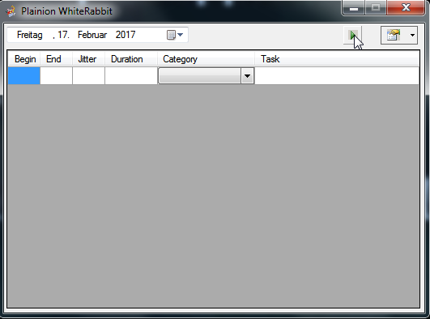
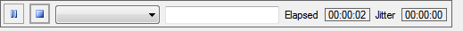
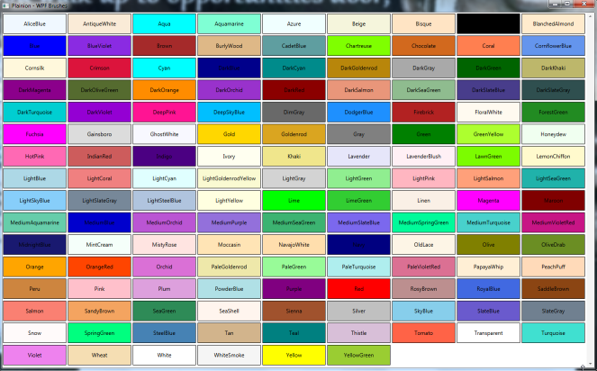

Plainions Beeyard of all the bees making daily work easier.

Just download the [latest release](https://github.com/plainionist/Plainion.Bees/releases), 
unpack whereever you want and enjoy :)

## WhiteRabbit

Track your time in a very convenient and simple way






## WpfBrushes

The standard color palette right at hand




## LoC

Count your lines of code in a simple way


```
Plainion.Starter -D [location of the beeyard] -Loc
```

## XamlEdit

Generate Visual Studio project with required assemblies to have intellisense when editing 
stand-alone Xaml config files.

```
Plainion.Starter -D [location of the beeyard] -XamlEdit
```

## TestIt

Simple wrapper around NUnit to run multiple test assemblies with simple command line

```
Plainion.Starter -D [location of the beeyard] -TestIt
```


